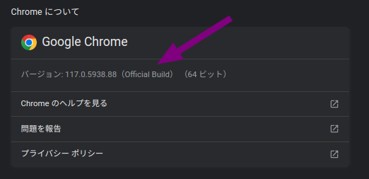
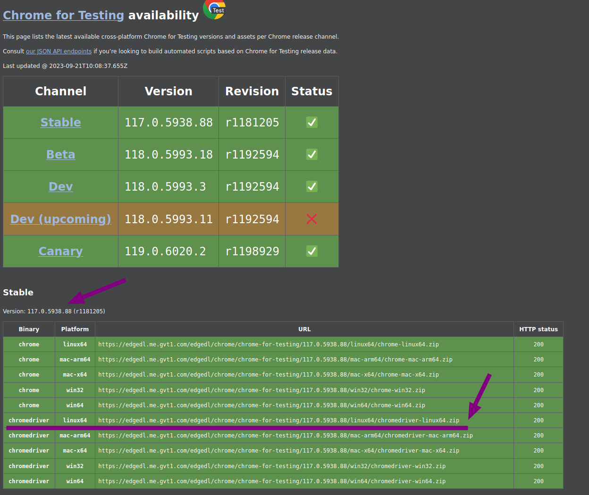

- [はじめに](#はじめに)
- [問題の発生](#問題の発生)
- [エラーメッセージ](#エラーメッセージ)
- [解決手順](#解決手順)
- [まとめ](#まとめ)

## はじめに
この記事は、ChromeのバージョンアップによってSeleniumで発生する一般的なエラーとその解決手順について解説するものです。

この記事は主に自分用の備忘録として書かれており、今後同様の問題に遭遇した際にすぐに対処できるようにすることを目的としています。

## 問題の発生
- セキュリティアップデート後にChromeがバージョンアップし、Seleniumで使用している`chromedriver`が古いバージョンであるためにエラーが発生。
- セキュリティアップデートのたびに、`pip install -U chromedriver-binary-auto`を行っていたが、今回は`chromedriver-binary-auto`のバージョンアップが間に合わず、数日に渡りエラーが発生。


## エラーメッセージ
- `SessionNotCreatedException: Message: session not created: This version of ChromeDriver only supports Chrome version 115`

## 解決手順

1. **Chromeのバージョン確認**
    - 使用しているChromeのバージョンを確認。このケースでは、バージョン117.0.5938.88。
    - 

2. **適切な`chromedriver`のダウンロード**
    - Chromeのバージョンに合った`chromedriver`を[Chrome for Testing availability dashboard](https://googlechromelabs.github.io/chrome-for-testing/)からダウンロード。
    - 

3. **`chromedriver`の配置**
    - ダウンロードした`chromedriver`をプロジェクトのディレクトリに配置。

4. **Pythonコードの修正**
    - Pythonスクリプト内で`webdriver.Chrome`を呼び出す際のパスを、新しくダウンロードした`chromedriver`のパスに修正。
   - 修正前
     ```python
     driver = webdriver.Chrome(
         '/home/user/project_dir/lib/python3.8/site-packages/chromedriver_binary/chromedriver',
         options=options
         )
     ```
   - 修正後
     ```python
     driver = webdriver.Chrome(
         '/home/user/project_dir/chromedriver-linux64/chromedriver',
         options=options
         )
     ```
5. **実行権限の確認**
    - `chmod +x /path/to/chromedriver`コマンドで`chromedriver`に実行権限を付与。
      ```bash
        drwxrwxr-x  2 user user     4096  9月 21 18:31 ./
        drwxrwxr-x 12 user user     4096  9月 21 18:33 ../
        -rw-r--r--  1 user user   250924  9月 15 07:52 LICENSE.chromedriver
        -rwxr-xr-x  1 user user 14078720  9月 15 07:52 chromedriver*
      ```
6. **スクリプトの再実行**
    - Pythonスクリプトを再実行して、エラーが解消されるか確認。

## まとめ
この記事では、ChromeのバージョンアップによってSeleniumで発生した具体的なエラーメッセージとその原因、そしてそれに対する解決策を1つ1つ確認していきました。
この記事が、同様の問題に直面した方の参考資料として役立てば幸いです。